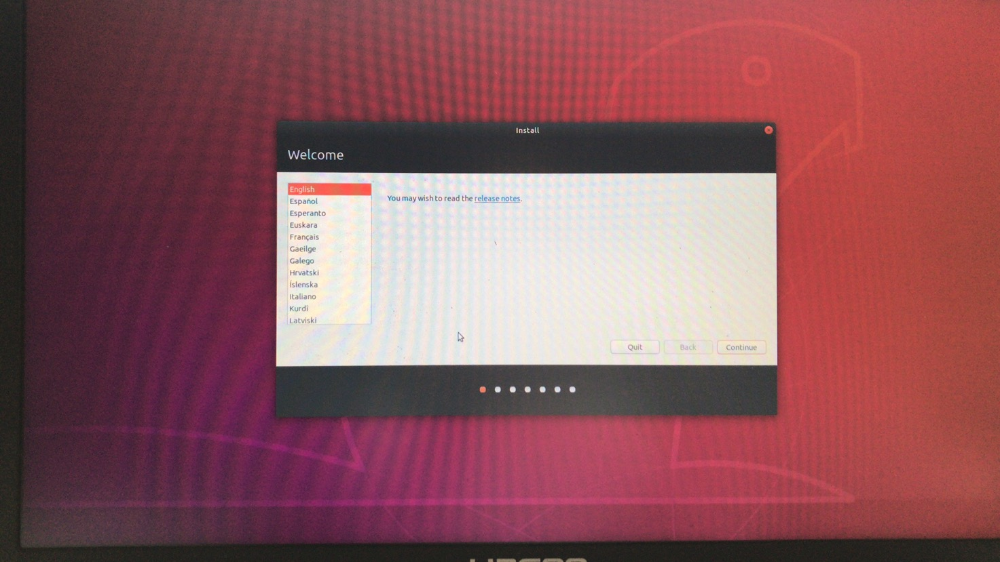
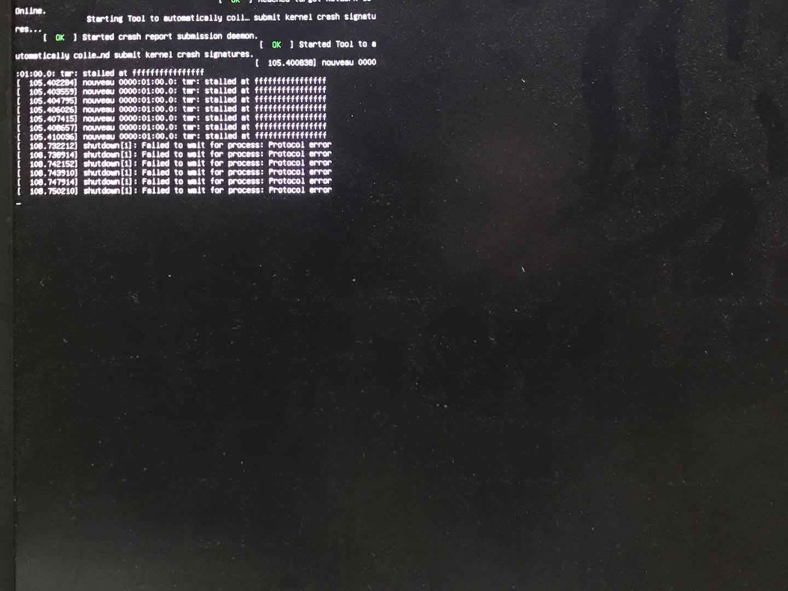

# Ubuntu 安装相关问题

<!-- @import "[TOC]" {cmd="toc" depthFrom=1 depthTo=3 orderedList=false} -->

<!-- code_chunk_output -->

- [Ubuntu 安装相关问题](#ubuntu-安装相关问题)
  - [安装新版本的Python3](#安装新版本的Python3)
    - [添加软件源](#添加软件源)
    - [安装](#安装)
  - [双系统相关](#双系统相关)
    - [解决神州电脑 Ubuntu 双系统安装问题](#解决神州电脑-ubuntu-双系统安装问题)

<!-- /code_chunk_output -->

## 安装新版本的Python3

**无论如何都不要卸载发行版自带的Python！** 系统很多组件依赖系统自带的python。（不过卸载了也不要紧，照着apt log装回来，还有救）

主要有两种方案：添加PPA；使用pyenv。两种方式各有优劣：PPA源在系统层面添加，直接下载二进制包，不用编译；而pyenv默认是安装到用户目录下，而且需要设置环境变量，需要编译。但是pyenv支持anaconda、pypy等。

### DeadSnakes PPA

#### 添加软件源

```bash
sudo add-apt-repository ppa:deadsnakes/ppa
sudo apt-get update
```

#### 安装

```bash
sudo apt -y install python3.8
```

之后使用`python3`，还是系统自己的python，用`python3.8`可以使用python 3.8。可以使用`update-alternatives`切换版本。

某个版本使用`pip`或者`venv`：

```bash
python3.8 -m pip install xxxx
python3.8 -m venv venv
```

要注意不要破坏系统的包，尽量`python3.x -m pip install --user`，或者直接在virtualenv里面安装。

### pyenv

在Linux下，通过[pyenv-installer](https://github.com/pyenv/pyenv-installer)安装：

```bash
curl https://pyenv.run | bash
```

要注意，可能需要参照[GitHub上的说明](https://github.com/pyenv/pyenv#set-up-your-shell-environment-for-pyenv)来设置环境变量。

## 双系统相关

### 联想Y7000P ubuntu16.04问题

1. wifi不显示
2. 触摸板不能用

#### 原因

内核版本过低，要升级内核，我将4.15升级到了5.12.16版本，升级内核可能会出现“possible missing firmware /lib/firmware/nvidia/gv108”等的带 nidia字样的错误，可以到https://launchpad.net/ubuntu/+source/linux-firmware 安装最新版的 linux-firmware 包 

重启可能会遇到横屏的问题，解决方法就用下面神州解决过程第五步

然后进入ubuntu之后就禁用nouveau 显卡，可参考：https://blog.csdn.net/u012442845/article/details/78855573/

### 解决神州电脑 Ubuntu 双系统安装问题

#### 症状

1. 安装 Ubuntu 时一直卡在语言选择界面
    
2. 强制重启后出现以下界面并在一段时间后自动关机
    

#### 解决过程
1. 首先尝试重做安装盘等常规方式，均无效
2. 联系到之前 ASUS 飞行堡垒 安装 windows10 时遇到显卡等设备无法驱动的问题，怀疑是某些硬件无驱动/不适配导致的
3. 了解到所用机器是`神州 kingbook T96E` 游戏本，有 NVIDIA 独显，搜索到神州品牌双系统风评不佳
4. 使用品牌名称进行搜索，发现[神州战神 WIN10 安装 Ubuntu 双系统教学-CSDN](https://blog.csdn.net/u011680118/article/details/90740181)，其中提到 nouveau 显卡驱动**会在选择语言等界面卡死**，符合症状 1 ，症状 2 中也出现过 nouveau 这个关键词，故进行尝试。
5. 使用此教程提供的方法成功解决：
    >在看到选择 "Try Ubuntu without installing" 与 "Install Ubuntu" 的选项时
    >1. 按向下键移到 Install Ubuntu 选项，键盘按e, 进入命令行模式，编辑文本
    >2. 在倒数第二行末尾的 quiet slash -- 后面(也可能没有 – )，添加以下内容
    >   acpi_osi=linux nomodeset
    >3. 修改上述选项可以在开机的时候，禁用nouveau 显卡 
    >4. 保存后回到上面界面，按回车执行 Install Ubuntu 命令，这时候可以顺利进入安装界面。
    >————————————————
    >版权声明：本文为CSDN博主「Anyanyamy」的原创文章，遵循CC 4.0 BY-SA版权协议，转载请附上原文出处链接及本声明。
    >原文链接：https://blog.csdn.net/u011680118/article/details/90740181
6. 在系统安装成功后，可参考[此教程](https://blog.csdn.net/tjuyanming/article/details/79267984)安装 NVIDIA 提供的相应驱动

#### 原因分析

根据搜索得到的信息，此问题主要是 NVIDIA 显卡的 mouveau 开源第三方驱动太烂造成的，多发于 NVIDIA 显卡与 Intel 核显共存的机器。Ubuntu 安装时 在识别到 NVIDIA 显卡后会自动使用此驱动，故要在安装先先禁止此驱动，安装 Ubuntu 后再安装显卡驱动。

#### 其他有价值的资料

* [一个安装时没有错误，启动后出错的例子](https://blog.csdn.net/qq_36090423/article/details/80141195)
* [一个完整叙述 NVIDIA 显卡电脑安装 Ubuntu 时问题及解决方案的帖子](https://blog.csdn.net/ysy950803/article/details/78507892?utm_medium=distribute.pc_relevant_t0.none-task-blog-BlogCommendFromMachineLearnPai2-1.compare)（推荐使用）
