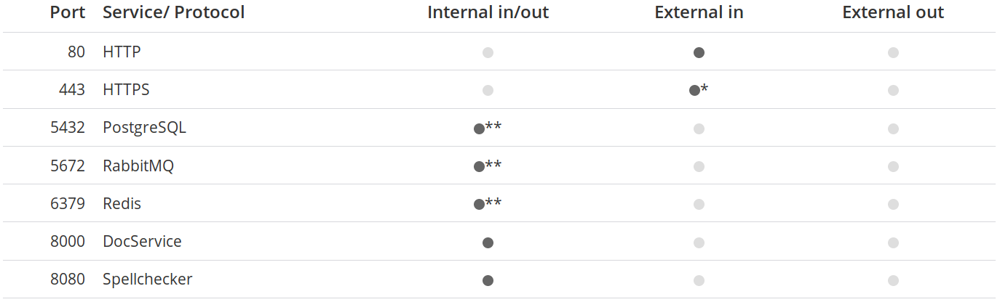
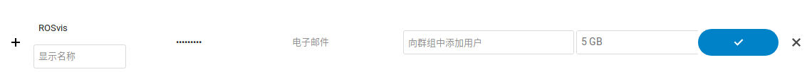

# NextCloud 搭建

## 前情提要

[NextCloud](https://nextcloud.com)是自[ownCloud](https://owncloud.org/)创建的分支。从[Google Trends](https://trends.google.com/trends/explore?geo=US&q=nextcloud,owncloud)来看，现在NextCloud的热度已经远远超过ownCloud了。

本篇记录了我搭建NextCloud的过程，最终实现上传下载文件、配合[OnlyOffice](https://www.onlyoffice.com/)在线编辑Office文件的功能。以下是我用于搭建的服务器的一些参数：

* OS：Ubuntu 16.04.6 LTS
* 服务器ip地址：47.106.78.107
* 服务器域名：cgboat.freeddns.org
* 开放端口：
     * 9000（用于NextCloud）
     * 9001（用于OnlyOffice）
* 全程使用root账户
* 由于云服务器有安全组，所以没有开防火墙

## 端口选择

默认情况下，NextCloud使用Apache，OnlyOffice的DocumentServer使用Nginx，两者各需要对外开放一个端口。OnlyOffice内部的一些服务，也需要使用一些端口：



当然，可以让NextCloud使用Nginx，以及通过配置Nginx修改DocumentServer内部占用的端口，但是一来我不会，二来没必要，所以还是躲开这些端口。我选的是9000和9001。

## 安装NextCloud

### 安装Apache与PHP

拿到Ubuntu之后，首先刷新软件源、升级、重启：

```bash
apt update && apt -y upgrade && apt -y autoremove
reboot
```

之后添加软件源，以安装PHP 7.4：

```bash
apt -y install software-properties-common
add-apt-repository -y ppa:ondrej/php
apt update && apt -y upgrade && apt -y autoremove
apt -y install apache2 php7.4 bzip2 libapache2-mod-php php-gd php-json php-mysql php-curl php-mbstring php-intl php-imagick php-xml php-zip php-bcmath php-gmp
```

### 安装PostgreSQL数据库

在Ubuntu 16.04上，DocumentServer与MariaDB数据库冲突，所以NextCloud不能用MySQL/Mariadb，只能用PostgreSQL：

```bash
apt -y install postgresql php-pgsql
```

接下来在数据库中为NextCloud建立用户和数据库：

```bash
sudo -u postgres psql
```

进入PostgreSQL命令行。

```sql
CREATE DATABASE nextcloud;
CREATE USER nc_user WITH PASSWORD 'nextcloud';
GRANT ALL PRIVILEGES ON DATABASE nextcloud to nc_user;
```

输入`\q`回车，退出。

### 安装NextCloud

下载NextCloud，放到`/var/www/`目录下：

```bash
wget https://download.nextcloud.com/server/releases/latest-19.tar.bz2 -O nextcloud-19-latest.tar.bz2
tar xjvf nextcloud-19-latest.tar.bz2
chown -R www-data:www-data nextcloud
mv nextcloud /var/www/
```

### 设置Apache和PHP

#### 改端口

修改`/etc/apache2/ports.conf`，将`Listen 80`改成`Listen 9000`

#### 添加NextCloud

添加`/etc/apache2/sites-available/nextcloud.conf`文件，内容：

```apacheconf
Alias /nextcloud "/var/www/nextcloud/"

<Directory /var/www/nextcloud/>
  Options +FollowSymlinks
  AllowOverride All

 <IfModule mod_dav.c>
  Dav off
 </IfModule>

 SetEnv HOME /var/www/nextcloud
 SetEnv HTTP_HOME /var/www/nextcloud

</Directory>
```

#### 启用NextCloud、启用模块

```bash
a2ensite nextcloud
a2enmod rewrite headers env dir mime
sed -i '/^memory_limit =/s/=.*/= 512M/' /etc/php/7.4/apache2/php.ini
systemctl restart apache2
```

### 设置NextCloud

#### 初始化

NextCloud的URL是`http://ip:port/nextcloud`，比如我的就是[http://cgboat.freeddns.org:9000/nextcloud](http://cgboat.freeddns.org:9000/nextcloud)。在浏览器中打开，进入设置界面：

* 管理员账户和密码，不用多说，后面还会用管理员账户建立其它账户、安装应用、设置NextCloud等。
* 数据库，这一步选择PostgreSQL，用户名`nc_user`，密码`nextcloud`，按照之前对数据库的设置进行填写。
* 推荐应用，没什么用，装不装都一样。

等待片刻，就完成了初始化设置，进入了管理员账号第一次使用的欢迎界面。

#### 创建ROSvis账户

用NextCloud来管理我们项目的幻灯片，按立来说，应该给每个人都创建一个账户。但是这样设置，互相看文件就很不方便，还要设置共享等等。不如像GitLab那样，大家的文件都放在一个账户里自己名字的文件夹下，这样比较简单。所以只创建一个ROSvis账户就够了。

单击右上角头像，在展开的菜单中选择“用户”，再点击左上角“新建用户”。这时在右侧用户列表上面填写用户名和密码，还有存储配额：



点击蓝色的确认按钮，ROSvis用户就出现在下方的用户列表中了。

#### 设置语言和地区

ROSvis账户的语言可能是英文，大家看起来也不是那么方便，所以把ROSvis账户的语言改成中文。

单击右上角用户头像，在弹出菜单中点击“登出”，回到登陆页面。输入ROSvis账户的登陆信息后点击登陆按钮，进入欢迎页面。单击右上角用户头像，在弹出菜单中单击“设置”，将“语言”改为“简体中文”，将“本地”改为“Chinese (Simplified, China)”。


#### 关闭无用功能

新用户的一些演示文件，我们都用不上，可以直接删掉。

另外“recommendations”和“富文本编辑区”这两个功能不仅没用，还容易导致误操作，建议关闭。


关闭方法：点击左下角设置，取消“显示富文本编辑区”和“Show recommendations”两项。


### 美化URL

隐藏URL中`index.php`的部分，使得URL更短、更漂亮。修改`/var/www/nextcloud/config/config.php`，添加一行

```php
'htaccess.RewriteBase' => '/nextcloud',
```

### 信任域名

默认情况下只能通过`cgboat.freeddns.org`这个域名访问，要通过ip地址`47.106.78.107`访问NextCloud，要将它添加到`/var/www/nextcloud/config/config.php`中：

```php
  'trusted_domains' =>
  array (
    0 => 'cgboat.freeddns.org:9000',
    1 => '47.106.78.107:9000',
  ),
```

### 启用缓存

设置两种缓存方案，以提高NextCloud的速度：

#### PHP OPCache

安装对应的PHP模块：

```bash
apt -y install php7.4-opcache
```

编辑`/etc/php/7.4/apache2/conf.d/10-opcache.ini`文件，将其内容改为：

```ini
; configuration for php opcache module
; priority=10
zend_extension=opcache.so
opcache.enable=1
opcache.enable_cli=1
opcache.interned_strings_buffer=8
opcache.max_accelerated_files=10000
opcache.memory_consumption=128
opcache.save_comments=1
opcache.revalidate_freq=1
```

之后重启Apache：

```bash
systemctl restart apache2
```

#### Redis server

安装Redis以及对应的PHP模块：

```bash
apt -y install redis-server php-redis
```

修改`/var/www/nextcloud/config/config.php`文件，添加以下内容：

```php
  'memcache.locking' => '\OC\Memcache\Redis',
  'memcache.distributed' => '\OC\Memcache\Redis',
  'memcache.local' => '\OC\Memcache\Redis',
  'redis' => [
  'host' => 'localhost',
    'port' => 6379,
    'timeout' => 3,
  ],
```

之后重启Apache：

```bash
systemctl restart apache2
```

## 安装OnlyOffice DocumentServer

### 设置数据库

为OnlyOffice添加用户和数据库：

```bash
sudo -i -u postgres psql -c "CREATE DATABASE onlyoffice;"
sudo -i -u postgres psql -c "CREATE USER onlyoffice WITH password 'onlyoffice';"
sudo -i -u postgres psql -c "GRANT ALL privileges ON DATABASE onlyoffice TO onlyoffice;"
```

### 安装依赖

```bash
apt -y install rabbitmq-server nginx-extras
```

### 设置端口

这个端口是Nginx监听的端口，将用于DocumentServer。我选择的是9001。

```bash
echo onlyoffice-documentserver onlyoffice/ds-port select 9001 | debconf-set-selections
```

### 安装Document Server

```bash
apt-key adv --keyserver hkp://keyserver.ubuntu.com:80 --recv-keys CB2DE8E5
echo "deb https://download.onlyoffice.com/repo/debian squeeze main" | tee /etc/apt/sources.list.d/onlyoffice.list
apt update
apt -y install onlyoffice-documentserver
```

安装过程中会要求输入PostgreSQL数据库中OnlyOffice用户的密码，在输入框中输入`onlyoffice`，确认即可。

安装完毕后，在浏览器中打开

### 安装OnlyOffice App

如何在NextCloud中使用OnlyOffice呢？需要安装OnlyOffice应用。

登陆管理员账户，单击右上角头像，在弹出菜单中选择“应用”。在左边侧栏中找到“Office & Text”分类，在其中找到OnlyOffice应用并安装。

但是，我在这里什么都看不到，于是只能手动安装了。

在OnlyOffice的[应用页面](https://apps.nextcloud.com/apps/onlyoffice)找到下载链接，下载、解压、安装：

```bash
wget https://github.com/ONLYOFFICE/onlyoffice-nextcloud/releases/download/v4.3.0/onlyoffice.tar.gz
tar xzvf onlyoffice.tar.gz
chown www-data:www-data onlyoffice
mv onlyoffice /var/www/nextcloud/apps/
```

这时，在NextCloud的应用管理页面中，在左面找到“已禁用的应用”，找到ONLYOFFICE，点击“启用”。

### 设置OnlyOffice App

单击右上角头像，在弹出菜单中选择“设置”。在左边侧栏中找到“ONLYOFFICE”，修改Document Editing Service address为[http://cgboat.freeddns.org:9001/](http://cgboat.freeddns.org:9001/)。注意，这里一定要写公网ip，不能写localhost或者内网ip。


点击Save按钮，保存设置。

### 显示汉字

在NextCloud中用OnlyOffice打开一份文档，如果里面的汉字都显示成方块，则需要修改语言设置。

使用`locale -a`命令查看可用的语言设置，如果列表中没有`zh_CN.UTF-8`和`en_US.UTF-8`，需要手动生成：

```bash
locale-gen zh_CN.UTF-8
locale-gen en_US.UTF-8
```

### 上传字体

用Microsoft Office做的幻灯片，里面用的全是Windows上才有的字体，所以把Windows下面的字体打包上传到服务器中。

在一台安装了Office的Windows上，将`C:\Windows\Fonts`文件夹下所有字体复制到`WinFonts`文件夹中，压缩成`WinFonts.zip`压缩包，之后上传到服务器中。解压安装：

```bash
apt -y install unzip
unzip WinFonts.zip
chmod 755 WinFonts
chmod 644 WinFonts/*
mv WinFonts /user/share/fonts/truetype/
fc-cache -fv
documentserver-generate-allfonts.sh
```

清除浏览器缓存，再打开文件，就能看到文档正确加载了微软的字体。

## 参考教程

1. [How to install NextCloud 19 on Ubuntu 18.04/19.04/19.10/20.04](https://www.marksei.com/how-to-install-nextcloud-19-on-ubuntu/)
2. [Installation on Linux](https://docs.nextcloud.com/server/19/admin_manual/installation/source_installation.html)
3. [Installing Document Server for Linux on Debian, Ubuntu and derivatives](https://helpcenter.onlyoffice.com/server/linux/document/linux-installation.aspx)
4. [Adding fonts to Document Server](https://helpcenter.onlyoffice.com/server/linux/document/install-fonts.aspx)
5. [Ports which must be opened for Integration Edition](https://helpcenter.onlyoffice.com/server/integration-edition/open-ports.aspx)
6. [Change port](https://dev.onlyoffice.org/viewtopic.php?f=44&t=11577)
7. [Nginx configuration](https://docs.nextcloud.com/server/19/admin_manual/installation/nginx.html)