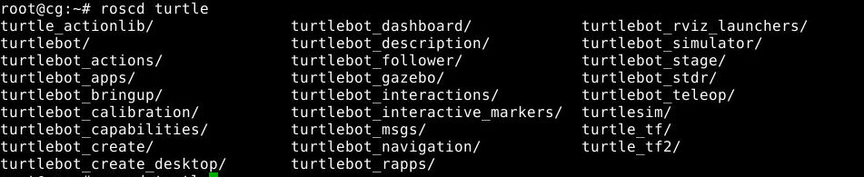

# Turtlebot 

<!-- @import "[TOC]" {cmd="toc" depthFrom=2 depthTo=6 orderedList=false} -->

<!-- code_chunk_output -->

- [安装](#安装)
  - [安装 ROS](#安装-ros)
  - [安装 Turtlebot](#安装-turtlebot)
    - [准备部分](#准备部分)
    - [下载与编译源码](#下载与编译源码)
    - [配置启动 Turtlebot 的环境](#配置启动-turtlebot-的环境)
  - [测试安装结果](#测试安装结果)
  - [设置 kobuki 别名](#设置-kobuki-别名)
  - [安装 kinetic 驱动](#安装-kinetic-驱动)
- [模拟](#模拟)
  - [stage](#stage)
  - [gazebo](#gazebo)

<!-- /code_chunk_output -->

## 安装

### 安装 ROS
* [教程](./ROS.md)

### 安装 Turtlebot

* 主要参考[此教程](https://www.ncnynl.com/archives/201811/2787.html)

#### 准备部分
    
```bash
sudo apt-get install python-rosdep python-wstool ros-kinetic-ros
sudo apt-get install pyqt5-dev-tools
sudo rosdep init
rosdep update
```

#### 下载与编译源码

分别建立三个工作空间rocon，kobuki，turtlebot，下载和编译源码。

**注意** 安装过程会从GitHub下载，建议使用`proxychains`设置代理。

* [rocon](http://wiki.ros.org/rocon)
    ```bash
    mkdir ~/rocon
    cd ~/rocon
    wstool init -j`nproc` src https://raw.github.com/robotics-in-concert/rocon/release/kinetic/rocon.rosinstall
    source /opt/ros/kinetic/setup.bash
    rosdep install --from-paths src -i -y
    catkin_make
    ```

* [kobuki](http://wiki.ros.org/kobuki): 主要与底盘运动相关
    ```bash
    mkdir ~/kobuki
    cd ~/kobuki
    wstool init -j`nproc` src https://raw.githubusercontent.com/yujinrobot/yujin_tools/kinetic-devel/rosinstalls/kinetic/kobuki.rosinstall
    source ~/rocon/devel/setup.bash
    rosdep install --from-paths src -i -y
    catkin_make
    ```

* [turtlebot](http://wiki.ros.org/Robots/TurtleBot/)
    ```bash
    mkdir ~/turtlebot
    cd ~/turtlebot
    wstool init -j`nproc` src https://raw.github.com/yujinrobot/yujin_tools/kinetic-devel/rosinstalls/kinetic/turtlebot.rosinstall
    source ~/kobuki/devel/setup.bash
    rosdep install --from-paths src -i -y
    catkin_make
    ```

#### 配置启动 Turtlebot 的环境

* 添加工作空间
    ```bash
    echo "source ~/rocon/devel/setup.bash" >> ~/.bashrc
    echo "source ~/kobuki/devel/setup.bash" >> ~/.bashrc
    echo "source ~/turtlebot/devel/setup.bash" >> ~/.bashrc
    ```
    也可直接打开 `~/.bashrc` 文件进行编辑
* 应用新环境
    ```bash
    source ~/.bashrc
    ```

### 测试安装结果
    若只涉及模拟，则此步完成后可跳过后续步骤

* 尝试进入安装目录
    ```bash
    roscd turtlebot
    ```
    正常进入目录即为安装成功

* 可使用 `roscd` 命令探测已安装的 turtlebot 相关包
    若正常安装，则结果如下图所示：
    

### 设置 kobuki 别名
    与 USB 串口连接 kobuki 相关

```bash
rosrun kobuki_ftdi create_udev_rules
```

### 安装 kinetic 驱动

```bash
sudo apt-get install ros-kinetic-openni-* ros-kinetic-openni2-* ros-kinetic-freenect-*
```

## 模拟

* 主要根据 [Turtlebot 2 的 ROS Wiki](http://wiki.ros.org/turtlebot/Tutorials/indigo)进行

### stage

此工具有图形化界面，可通过在地图中设定目的点观察机器人探测环境、寻找路线的过程

```bash
roslaunch turtlebot_stage turtlebot_in_stage.launch
```
可根据[此教程](http://wiki.ros.org/turtlebot_stage/Tutorials/indigo/Customizing%20the%20Stage%20Simulator)更改 `world` 等配置文件，重新启动并观察效果

### gazebo

是一个三维图形化模拟器，可结合 `keyboard_teleop` 控制机器人在一个模拟世界中运动，并观察其探索世界、建立地图的过程

* 启动

    ```bash
    roslaunch turtlebot_gazebo turtlebot_world.launch
    ```
