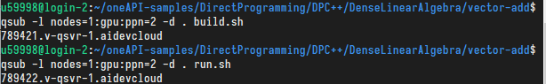

## Vector-Add

转到矢量加示例：

```shell
cd oneAPI-samples/DirectProgramming/DPC++/DenseLinearAlgebra/vector-add/
```

### 以批处理方式执行

按照教程创建build.sh和run.sh分别提交到计算节点执行



二者得到的stdout文件内容分别为：

+ build.sh.o789421:

  ```
  ########################################################################
  #      Date:           Thu 04 Feb 2021 06:18:18 AM PST
  #    Job ID:           789421.v-qsvr-1.aidevcloud
  #      User:           u59998
  # Resources:           neednodes=1:gpu:ppn=2,nodes=1:gpu:ppn=2,walltime=06:00:00
  ########################################################################
  
  :: WARNING: setvars.sh has already been run. Skipping re-execution.
     To force a re-execution of setvars.sh, use the '--force' option.
     Using '--force' can result in excessive use of your environment variables.
  rm -f vector-add-buffers vector-add-usm
  dpcpp -O2 -g -std=c++17 -o vector-add-buffers src/vector-add-buffers.cpp
  
  ########################################################################
  # End of output for job 789421.v-qsvr-1.aidevcloud
  # Date: Thu 04 Feb 2021 06:18:29 AM PST
  ########################################################################
  ```

+ run.sh.o789422:

  ```
  ########################################################################
  #      Date:           Thu 04 Feb 2021 06:18:30 AM PST
  #    Job ID:           789422.v-qsvr-1.aidevcloud
  #      User:           u59998
  # Resources:           neednodes=1:gpu:ppn=2,nodes=1:gpu:ppn=2,walltime=06:00:00
  ########################################################################
  
  :: WARNING: setvars.sh has already been run. Skipping re-execution.
     To force a re-execution of setvars.sh, use the '--force' option.
     Using '--force' can result in excessive use of your environment variables.
  ./vector-add-buffers
  Running on device: Intel(R) Core(TM) i9-10920X CPU @ 3.50GHz
  Vector size: 10000
  [0]: 0 + 0 = 0
  [1]: 1 + 1 = 2
  [2]: 2 + 2 = 4
  ...
  [9999]: 9999 + 9999 = 19998
  Vector add successfully completed on device.
  
  ########################################################################
  # End of output for job 789422.v-qsvr-1.aidevcloud
  # Date: Thu 04 Feb 2021 06:18:35 AM PST
  ########################################################################
  ```

可以看到，该样例执行了长度为10000的矢量加操作，计算被分配到Intel(R) Core(TM) i9-10920X CPU @ 3.50GHz计算节点上执行。

### 代码分析

```c++
//==============================================================
// Vector Add is the equivalent of a Hello, World! sample for data parallel
// programs. Building and running the sample verifies that your development
// environment is setup correctly and demonstrates the use of the core features
// of DPC++. This sample runs on both CPU and GPU (or FPGA). When run, it
// computes on both the CPU and offload device, then compares results. If the
// code executes on both CPU and offload device, the device name and a success
// message are displayed. And, your development environment is setup correctly!
//
// For comprehensive instructions regarding DPC++ Programming, go to
// https://software.intel.com/en-us/oneapi-programming-guide and search based on
// relevant terms noted in the comments.
//
// DPC++ material used in the code sample:
// •	A one dimensional array of data.
// •	A device queue, buffer, accessor, and kernel.
//==============================================================
// Copyright © Intel Corporation
//
// SPDX-License-Identifier: MIT
// =============================================================
#include <CL/sycl.hpp>
#include <array>
#include <iostream>
#if FPGA || FPGA_EMULATOR
#include <CL/sycl/INTEL/fpga_extensions.hpp>
#endif

using namespace sycl;

// Array type and data size for this example.
constexpr size_t array_size = 10000;
typedef std::array<int, array_size> IntArray;

// Create an exception handler for asynchronous SYCL exceptions
static auto exception_handler = [](sycl::exception_list e_list) {
  for (std::exception_ptr const &e : e_list) {
    try {
      std::rethrow_exception(e);
    }
    catch (std::exception const &e) {
#if _DEBUG
      std::cout << "Failure" << std::endl;
#endif
      std::terminate();
    }
  }
};

//************************************
// Vector add in DPC++ on device: returns sum in 4th parameter "sum_parallel".
//************************************
void VectorAdd(queue &q, const IntArray &a_array, const IntArray &b_array,
               IntArray &sum_parallel) {
  // Create the range object for the arrays managed by the buffer.
  range<1> num_items{a_array.size()};

  // Create buffers that hold the data shared between the host and the devices.
  // The buffer destructor is responsible to copy the data back to host when it
  // goes out of scope.
  buffer a_buf(a_array);
  buffer b_buf(b_array);
  buffer sum_buf(sum_parallel.data(), num_items);

  // Submit a command group to the queue by a lambda function that contains the
  // data access permission and device computation (kernel).
  q.submit([&](handler &h) {
    // Create an accessor for each buffer with access permission: read, write or
    // read/write. The accessor is a mean to access the memory in the buffer.
    accessor a(a_buf, h, read_only);
    accessor b(b_buf, h, read_only);

    // The sum_accessor is used to store (with write permission) the sum data.
    accessor sum(sum_buf, h, write_only, noinit);

    // Use parallel_for to run vector addition in parallel on device. This
    // executes the kernel.
    //    1st parameter is the number of work items.
    //    2nd parameter is the kernel, a lambda that specifies what to do per
    //    work item. The parameter of the lambda is the work item id.
    // DPC++ supports unnamed lambda kernel by default.
    h.parallel_for(num_items, [=](auto i) { sum[i] = a[i] + b[i]; });
      //[=]默认以值捕获所有变量
  });
}

//************************************
// Initialize the array from 0 to array_size - 1
//************************************
void InitializeArray(IntArray &a) {
  for (size_t i = 0; i < a.size(); i++) a[i] = i;
}

//************************************
// Demonstrate vector add both in sequential on CPU and in parallel on device.
//************************************
int main() {
  // Create device selector for the device of your interest.
#if FPGA_EMULATOR
  // DPC++ extension: FPGA emulator selector on systems without FPGA card.
  INTEL::fpga_emulator_selector d_selector;
#elif FPGA
  // DPC++ extension: FPGA selector on systems with FPGA card.
  INTEL::fpga_selector d_selector;
#else
  // The default device selector will select the most performant device.
  default_selector d_selector;
#endif

  // Create array objects with "array_size" to store the input and output data.
  IntArray a, b, sum_sequential, sum_parallel;

  // Initialize input arrays with values from 0 to array_size - 1
  InitializeArray(a);
  InitializeArray(b);

  try {
    queue q(d_selector, exception_handler);

    // Print out the device information used for the kernel code.
    std::cout << "Running on device: "
              << q.get_device().get_info<info::device::name>() << "\n";
    std::cout << "Vector size: " << a.size() << "\n";

    // Vector addition in DPC++
    VectorAdd(q, a, b, sum_parallel);
  } catch (exception const &e) {
    std::cout << "An exception is caught for vector add.\n";
    std::terminate();
  }

  // Compute the sum of two arrays in sequential for validation.
  for (size_t i = 0; i < sum_sequential.size(); i++)
    sum_sequential[i] = a[i] + b[i];

  // Verify that the two arrays are equal.
  for (size_t i = 0; i < sum_sequential.size(); i++) {
    if (sum_parallel[i] != sum_sequential[i]) {
      std::cout << "Vector add failed on device.\n";
      return -1;
    }
  }

  int indices[]{0, 1, 2, (a.size() - 1)};
  constexpr size_t indices_size = sizeof(indices) / sizeof(int);

  // Print out the result of vector add.
  for (int i = 0; i < indices_size; i++) {
    int j = indices[i];
    if (i == indices_size - 1) std::cout << "...\n";
    std::cout << "[" << j << "]: " << a[j] << " + " << b[j] << " = "
              << sum_parallel[j] << "\n";
  }

  std::cout << "Vector add successfully completed on device.\n";
  return 0;
}
```

#### 基本流程

+ 根据数据创建缓冲区
+ 创建包含数据访问权限和设备计算（kernel）的lambda函数
  + 为缓冲区创建accessor
  + 指定并行任务
+ 提交到任务队列

#### 使用到的DPC++特性

+ device queue
+ buffer
+ accessor
+ kernel

#### 对于DPC++的基本认识

通过buffer这样的定义抽象不同设备的存储，accessor抽象不同设备访问存储的方式。