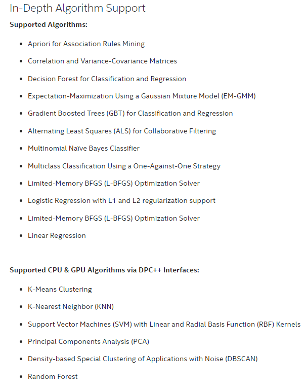

# **Intel® oneAPI**

With computer system architecture entering a period of prosperity in which CPUs, GPUs, FPGAs, and AI Accelerators complementary to each other, the diversity of hardware brings the complexity of software design and development. Intel® oneAPI is a cross-industry, open, standards-based unified programming model that delivers a common developer experience across accelerator architectures—for faster application performance, more productivity, and greater innovation with its single, unified open development model for performant and productive heterogeneous programming and cross-vendor support.

## Intel oneAPI

- [DevCloud]( https://devcloud.intel.com/oneapi/), [github](https://github.com/oneapi-src), [Forum](https://software.intel.com/en-us/forums/intel-oneapi-forums)
- [How to install the Intel oneAPI base toolkit](./安装oneAPIBaseToolkit本地环境.md)

### About ML & DL

+ [Intel® oneAPI Data Analytics Library](https://software.intel.com/content/www/us/en/develop/tools/oneapi/components/onedal.html#gs.08b3jj)

  ​	

  + [Get Started Guide](https://software.intel.com/content/www/us/en/develop/documentation/get-started-intel-oneapi-data-analytics-library/top.html)
  + [oneDAL Programming Guide](https://software.intel.com/content/www/us/en/develop/documentation/onedal-developer-guide-and-reference/top.html)

+ [Intel® oneAPI Deep Neural Network Library](https://software.intel.com/content/www/us/en/develop/tools/oneapi/components/onednn.html#gs.08edxx)

  + Github:https://oneapi-src.github.io/oneDNN/v2/
  + primitives:https://spec.oneapi.com/versions/latest/elements/oneDNN/source/primitives/index.html
  + Sample:
    + https://github.com/oneapi-src/oneAPI-samples/tree/master/Libraries/oneDNN/dpcpp_interoperability
    + https://github.com/oneapi-src/oneAPI-samples/tree/master/Libraries/oneDNN/simple_model

## Language Specifications

- [SYCL](https://www.khronos.org/sycl/): [sycl-2020.html](https://www.khronos.org/registry/SYCL/specs/sycl-2020/html/sycl-2020.html)

## DevCloud

+ [How to use the Intel DevCloud](./DevCloud/DevCloudforOneAPI使用.md)

## DPC++

+ The book to introduce the Data Parallel C++ : [Data Parallel C++](https://www.apress.com/jp/book/9781484255735)

### Samples

- [Data Parallel C++ Book Source Samples](https://github.com/Apress/data-parallel-CPP)
- [Intel oneAPI Toolkit Samples](https://github.com/oneapi-src/oneAPI-samples)

