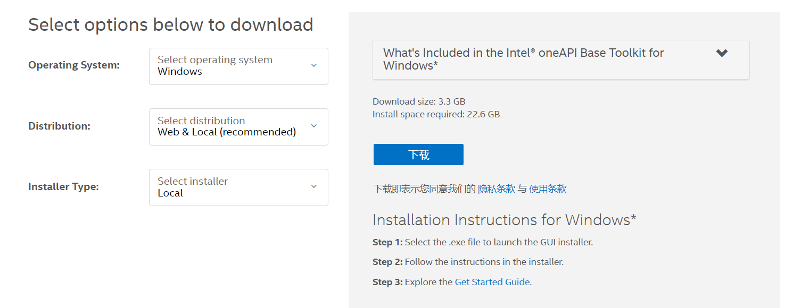
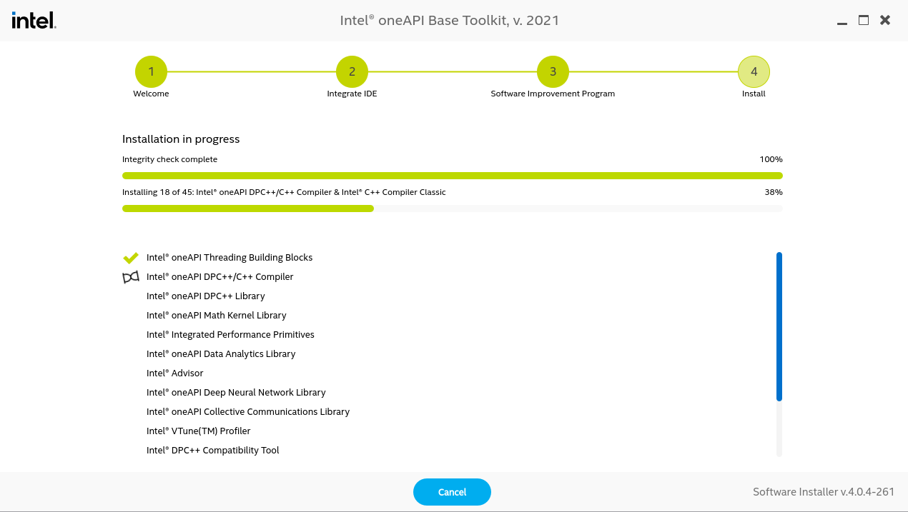
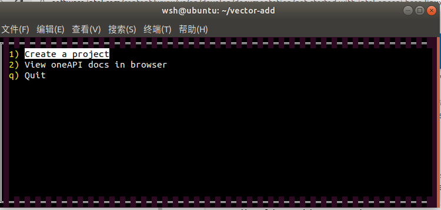
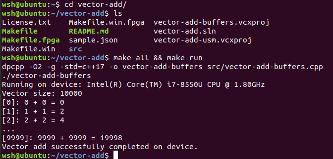

### 下载安装

在oneAPI Base Toolkit下载界面进行下载:[地址](https://software.intel.com/content/www/cn/zh/develop/tools/oneapi/base-toolkit/download.html)

选择对应的操作系统和安装方式进行下载



如没有申请权限，在点击下载后会转至申请界面，按照要求填写即可

依据安装提示进行安装即可



为了方便，使用ubuntu18.04作为开发系统。

+ 安装必要的工具

```shell
$ sudo apt update
$ sudo apt -y install cmake pkg-config build-essential
```

+ 配置环境变量，如果是在自己的专门用来做oneAPI实验的虚拟机中，为了方便，可以直接将以下命令放置到`.bashrc`文件中，否则需要每次打开一个shell后都手动执行以下命令：

```shell
. /opt/intel/oneapi/setvars.sh
```

### 测试

配置好环境变量之后，打开一个终端执行

```shell
$ oneapi-cli
```



选择创建一个新项目，以Vector-Add为例

进入vector-add文件夹，并build

```shell
$ cd vector-add
$ make all
$ make run
```



可以看到样例已经成功在本地的CPU上执行了，环境搭建成功。

