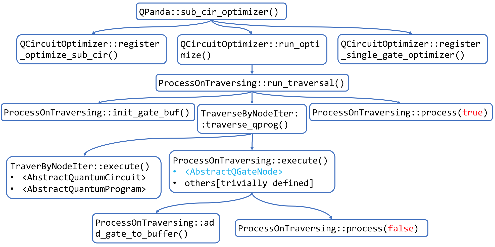

# Utilities.Tools

## ProcessOnTraversing

**OptimizerNodeInfo**

```C++
struct OptimizerNodeInfo {
  NodeIter m_iter;
  size_t m_layer;
  QVec m_target_qubits;
  QVec m_ctrl_qubits;
  GateType m_type;
  std::shared_ptr<QNode> m_parent_node;
  int m_sub_graph_index;
}
```

​	该结构用于在线路替换算法的执行过程中保存门节点的相关信息。`QGate`的表达能力不足以表达在线路替换算法中所需要的内容，因此引入了这一结构。

​	同时，在`ProcessOnTraversing.h`文件中还基此定义了其他数据结构：

```c++
using pOptimizerNodeInfo = std::shared_ptr<OptimizerNodeInfo>;
using GatesBufferType = std::pair<size_t, std::list<pOptimizerNodeInfo>>;
using OptimizerSink = std::map<size_t, std::list<pOptimizerNodeInfo>>;
```

​	其中`OptimizerSink`将量子比特映射到与其相关的量子门信息。

**ProcessOnTraversing**

```C++
class ProcessOnTraversing : protected TraverseByNodeIter
{
public:
  using layer_iter_seq = TopologSequence<std::pair<size_t, NodeIter>>; 
public:
  virtual ~ProcessOnTraversing() {}
  
  virtual void process(bool on_travel_end) = 0;
  virtual void run_traversal(QProg src_prog, const QVec qubits = {});
  
  void execute(std::shared_ptr<AbstractQGateNode> cur_node, std::shared_ptr<QNode> parent_node, QCircuitParam &cir_param, NodeIter& cur_node_iter) override;
	void execute(std::shared_ptr<AbstractQuantumMeasure> cur_node, std::shared_ptr<QNode> parent_node, QCircuitParam &cir_param, NodeIter& cur_node_iter) override;
	void execute(std::shared_ptr<AbstractQuantumReset> cur_node, std::shared_ptr<QNode> parent_node, QCircuitParam &cir_param, NodeIter& cur_node_iter) override;
	void execute(std::shared_ptr<AbstractControlFlowNode> cur_node, std::shared_ptr<QNode> parent_node, QCircuitParam &cir_param, NodeIter& cur_node_iter) override;
	void execute(std::shared_ptr<AbstractClassicalProg> cur_node, std::shared_ptr<QNode> parent_node, QCircuitParam &cir_param, NodeIter& cur_node_iter) override;
	void execute(std::shared_ptr<AbstractQuantumCircuit> cur_node, std::shared_ptr<QNode> parent_node, QCircuitParam &cir_param, NodeIter& cur_node_iter) override;
	void execute(std::shared_ptr<AbstractQuantumProgram> cur_node, std::shared_ptr<QNode> parent_node, QCircuitParam &cir_param, NodeIter& cur_node_iter) override;
  
protected:
  virtual void add_gate_to_buffer(NodeIter iter, QCircuitParam &cir_param, std::shared_ptr<QNode> parent_node, OptimizerSink& gates_buffer);
	virtual void add_non_gate_to_buffer(NodeIter iter, NodeType node_type, QVec gate_qubits, 
     QCircuitParam &cir_param, OptimizerSink& gates_buffer, 
     std::shared_ptr<QNode> parent_node = nullptr);
	virtual size_t get_node_layer(QVec gate_qubits, OptimizerSink& gate_buffer);
	virtual size_t get_min_include_layers();
  // 初始化QGateBuffer
	void init_gate_buf() {
		for (const auto& item : m_qubits)
		{
			m_cur_gates_buffer.insert(GatesBufferType(item->getPhysicalQubitPtr()->getQubitAddr(), std::list<pOptimizerNodeInfo>()));
		}
	}
  
protected:
  QVec m_qubits;
  OptimizerSink m_cur_gates_buffer;
  size_t m_min_layer;
}
```

**成员变量说明**

| 成员名             | 数据类型      | 备注                                                         |
| ------------------ | ------------- | ------------------------------------------------------------ |
| m_qubits           | QVec          | 保存Qubit的向量<br>在init_gate_buf函数中利用m_qubits包含的信息初始化m_cur_gate_buffer |
| m_cur_gates_buffer | OptimizerSink | OptimizerSink结构是一个从qubit到<br/>`std::list<pOptimizerNodeInfo>`的结构，<br/>保存的是与每个量子比特相关的结点信息。<br/>这里的节点可以是量子门。 |
| m_min_layer        | size_t        |                                                              |

**成员函数说明**

​	其中，值得注意的是一系列的`execute()`函数。这些`execute()`函数服务于线路替换算法过程，其功能类似于访问者模式中的`visit()`函数。以第一个输入参数`Abstract__`（各结点基类）进行区分，这些`execute()`函数分别对应于`NodeType`中的`GATE_NODE`, `MEASURE_NODE`, `RESET_NODE`, `WHILE_START_NODE`, `CIRCUIT_NODE`和`PROG_NODE`。其中，缺少与`AbstractClassicalProg`所对应的`NodeType`。

​	另外，`ProcessOnTraversing`类并没有实现父类`TraverseByNodeIter`的`traverse_qprog()`函数。所以在`run_traversal()`过程中会直接调用父类的函数。

​	`execute()`函数的第一个参数为需要访问的结点，第二个参数类似于语法树中的父节点。

```C++
void ProcessOnTraversing::execute(std::shared_ptr<AbstractQGateNode> cur_node, std::shared_ptr<QNode> parent_node, QCircuitParam &cir_param, NodeIter& cur_node_iter)
{
	// push_back cur_node_iter to related qubits
	add_gate_to_buffer(cur_node_iter, cir_param, parent_node, m_cur_gates_buffer);

	//optimizer
	size_t min_include_layers = get_min_include_layers();
	if (min_include_layers > MAX_INCLUDE_LAYERS)
	{
		process(false);
	}
}
```

​	其中，`MAX_INCLUDE_LAYERS`是一个在同一文件中定义的宏变量，其值为8192。该函数的功能如下：

+ 将当前门结点加入到`m_cur_gates_buffer`中
+ 如果当前门的层数已经高于`MAX_INCLUDE_LAYERS`时，对其进行处理

​    其余的`execute()`函数均调用父类`TraverseByNodeIter`对应的`execute()`函数进行处理，而这些函数都是空定义。所以这一系列函数中，唯一有用的函数。

## QCircuitOptimizer

**AbstractCirOptimizer**

​	文档中没有记录。从成员函数看来包括两个函数，`do_optimize`根据

```c++
class AbstractCirOptimizer {
  virtual void do_optimize(QProg src_prog, OptimizerSink &gates_sink, std::vector<QCircuit>& replace_to_cir_vec) = 0;
  virtual bool is_same_controled(pOptimizerNodeInfo first_node, pOptimizerNodeInfo second_node);
}
```

**OptimizerSubCir**

```C++
struct optimizerSubCir {
  // 替换的目标子线路
  QCircuit target_sub_cir;
  // 被替换的源子线路
  QCircuit replace_to_sub_cir;
  OptimizerSink m_sub_cir_gates_buffer;
}
```

​	根据结构的名字推断这应该是用于子线路替换的工具，即有可能是等价线路变换中需要用到的数据结构。可以通过查找`target_sub_cir`——推测是目标子线路的意思——来判断哪个函数用于替换子线路。

**FindSubCircuit**

```c++
class FindSubCircuit {
public:
  template <class T>
  	using MatchNode = seqNode<T>;
  template <class T>
    using MatchNodeVec = std::vector<MatchNode<T>>;
  using MatchNodeTable = std::vector<std::pair<pOptimizerNodeInfo, MatchNodeVec<pOptimizerNodeInfo>>>;
private:
  TopologSequence<pOptimizerNodeInfo>& m_topolog_sequence;
  std::vector<TopologSequence<pOptimizerNodeInfo>> m_sub_graph_vec; /* Multiple possible matching subgraphs, each of which is stored in the form of topological sequence */
	MatchNodeTable m_node_match_vector;
}
```

+ 公共变量和私有变量参考以上代码
+ 公有函数
	+ 构造函数`FindSubCircuit`和析构函数`~FindSubCircuit`
	+ 见下表：

| 函数定义                                                     | 函数功能                                                     |
| ------------------------------------------------------------ | ------------------------------------------------------------ |
| sub_cir_query(<br>TopologSequence<pOptimizerNodeInfo>& sub_sequence) | 查询子图并将查询结果保存在query_Result中                     |
| node_match(<br>const SeqNode<pOptimizerNodeInfo>& target_seq_node,<br>const SeqNode<pOptimizerNodeInfo>& graph_node) | 从函数定义看来，主要是比对<br/>`target_seq_node`和`graph_node`两者的<br>类型是否相等。 |
| match_layer(<br>SeqLayer<pOptimizerNodeInfo>& sub_seq_layerb,<br>const size_t match_layer,<br>std::vector<TopologSequence<pOptimizerNodeInfo>>&<br> sub_graph_vec) | 层匹配：匹配且合并子图中每一层的节点                         |
|                                                              |                                                              |

**QCircuitOptimizer**

```C++
class QCircuitOPtimizer : public ProcessOnTraversing
{
public:
  QCircuitOptimizer();
  ~QCircuitOptimizer();
  void process(bool on_travel_end = false) override;
	void register_single_gate_optimizer(const OptimizerFlag mode);
	void register_optimize_sub_cir(QCircuit sub_cir, QCircuit replase_to_cir);
	void run_optimize(QProg src_prog, const QVec qubits = {}, bool b_enable_I = false);
  // 虽然代码中是replase_sub_cir，但是在笔记中会记作replace_sub_cir
  QProg replase_sub_cir(std::function<QCircuit(const size_t)> get_cir_fun);
	void sub_cir_optimizer(const size_t optimizer_sub_cir_index);
	void do_optimizer();
protected:
  void mark_sub_graph(const std::vector<TopologSequence<pOptimizerNodeInfo>>& sub_graph_vec);
public:
	QProg m_new_prog;
	/* Optimise mode */
	static const unsigned char Merge_H_X = 1;
	static const unsigned char Merge_U3 = (1 << 1);
	static const unsigned char Merge_RX = (1 << 2);
	static const unsigned char Merge_RY = (1 << 3);
	static const unsigned char Merge_RZ = (1 << 4);
private:
  QProg m_sub_prog;
	std::vector<std::shared_ptr<AbstractCirOptimizer>> m_optimizers;
	std::vector<OptimizerSubCir> m_optimizer_cir_vec;
	TopologSequence<pOptimizerNodeInfo> m_topolog_sequence;
	FindSubCircuit m_sub_cir_finder;
	std::vector<std::map<size_t, Qubit*>> m_sub_graph_qubit_map_vec;/* qubit mapping of each sub-graph */
	size_t m_cur_optimizer_sub_cir_index;
	std::vector<QProg> m_tmp_cir_vec; /* Temporary QCircuits for storing QGate nodes */
	std::vector<std::vector<double>> m_angle_vec; /* Angle variable of each sub-graph */ 
	bool m_b_enable_I;
}
```

​	

## JsonConfigParam

​		在该文件中同时定义了配置文件的路径宏`#define CONFIG_PATH "QPandaConfig.json"`，即根目录下的`QPandaConfig.json`配置文件。

**JsonConfigParam**

+ 变量

| 变量名         | 数据类型            | 访问范围 | 变量功能 |
| -------------- | ------------------- | -------- | -------- |
| m_doc          | rapidjson::Document | private  |          |
| m_json_content | std::string         | private  |          |

+ 函数接口

| 函数名                                                       | 函数功能                                                     |
| ------------------------------------------------------------ | ------------------------------------------------------------ |
| bool load_config(const std::string config_data = CONFIG_PATH) | 加载json配置数据<br>输入参数config_data可以是配置文件或者配置数据，用后缀名判断 |
| rapidjson::Document& get_root_element()                      | 返回m_doc变量                                                |
| static bool readAdjacentMatrix(<br>const rapidjson::Value& AdjacentMatrixElement,<br>int &qubit_num,<br>std::vector\<std::vector<double\>> &vec,<br>const std::string configFile="" ) | 从json配置文件中获得拓扑结构                                 |

+ 下面结合cpp文件具体介绍各个函数
+ `bool JsonConfigParam::load_config(const std::string file_name)`
	+ 首先，程序利用`std::string::substr()`函数和`std::transform()`函数提取出输入参数`file_name`的最后五个字符作为后缀。并将其与`.json`进行比对
	+ 如果后缀名不是`.json`，说明此时输入的`config_data`是配置数据，将其直接赋值给私有变量`m_json_content`；
	+ 如果后缀名是`.json`，说明此时输入的`config_data`是配置文件名。利用`reader`将内容读取出来放到`m_json_content`中；

**QCircuitOptimizerConfig**

```c++
class QCircuitOptimizerConfig {
#define ANGLE_VAR_BASE 1024
public:
  static QCircuitOptimizerConfig& get_instance() {
    static QCircuitOptimizerConfig _instance;
    return _instance;
  }
	~QCircuitOptimizerConfig();
  bool get_replace_cir(std::vector<std::pair<QCircuit, QCircuit>>& replace_cir_vec);
private:
  QCircuitOptimizerConfig();
	QCircuit read_cir(const rapidjson::Value& gates);
	QGate build_sing_ratation_gate(std::string gate_name, Qubit* target_qubit, double angle);
	QGate build_sing_gate(std::string gate_name, Qubit* target_qubit);
	QGate build_double_gate(std::string gate_name, QVec qubits);
	QGate build_double_ratation_gate(std::string gate_name, QVec qubits, double angle);
	double angle_str_to_double(const std::string angle_str);
private:
	JsonConfigParam m_config_file;
	CPUQVM m_qvm;
	QVec m_qubits;
}
```

## 功能

### Json文件读取

​	QPanda的线路替换算法需要从外部读取等价线路线路信息，而这部分信息保存在根目录下的Json配置文件中

​	这一部分的功能由`QCircuitOptimizerConfig`类实现。这个类保存Json文件中定义的量子线路优化有关的配置。在构造函数中：

```C++
QCircuitOptimizerConfig::QCircuitOptimizerConfig()
{
  m_config_file.load_config(CONFIG_PATH);
  m_qvm.init();
}
```

​	其中`m_config_file`是`QCircuitOptimizerConfig`的成员变量，数据类型为`JsonConfigParam`。从这来看，`m_config_file`用来保存和读取Json文件中的配置信息。其中比较重要的函数为`get_replace_cir`(代码中写的是`get_replase_cir`)和`read_cir`。这两个函数会在执行线路替换算法的期间被调用，此时Json文件读取的信息会被用于实现算法。

### 线路替换

​		这个功能的接口`QPanda::sub_cir_optimizer`位于`QCircuitOptimizer.cpp`最后作为通用接口。首先给出一个大概的流程：



​		从`QCircuitOptimizer.test.cpp`以及QPanda工作人员的介绍看来，对量子线路优化的入口函数是`QPanda::sub_cir_optimizer`。注意这里不要与`QCircuitOptimizer::sub_cir_optimizer`弄混。

```C++
void QPanda::sub_cir_optimizer(QCircuit& src_cir, std::vector<std::pair<QCircuit, QCircuit>> optimizer_cir_vec, const OptimizerFlag mode)
{
  flattern(src_cir);
  
  QCircuitOptimizer tmp_optimizer;
  for (auto& optimizer_cir_pair : optimizer_cir_vec)
	{
		tmp_optimizer.register_optimize_sub_cir(optimizer_cir_pair.first, optimizer_cir_pair.second);
	}
	tmp_optimizer.register_single_gate_optimizer(mode);
	tmp_optimizer.run_optimize(src_cir/*, used_qubits*/);

	flatten(tmp_optimizer.m_new_prog, true);
	src_cir = QProgFlattening::prog_flatten_to_cir(tmp_optimizer.m_new_prog);
}
```

​	该函数具有两个重载版本，`src_cir`的数据类型分别为`QCircuit&`和`QProg&`。结合`QCircuitOptimizer.test.cpp`，输入参数`src_cir`显然是需要进行优化的线路。而`optimizer_cir_vec`从函数实现看来，其保存着需要进行替换的线路对。其函数的实现也可以看出这一点：

```C++
void QCircuitOptimizer::register_optimize_sub_cir(QCircuit sub_cir, QCircuit replace_to_cir) {
  OptimizerSubCir tmp_optimizer_sub_cir;
  tmp_optimizer_sub_cir.target_sub_cir = sub_cir;
  tmp_optimizer_sub_cir.replace_to_sub_cir = replase_to_cir;
  m_optimizer_cir_vec.push_back(tmp_optimizer_sub_cir);
}
```

​	在`QCircuitOptimizer.test.cpp`中，输入的`optimizer_cir_vec`是一个未被赋值的线路对向量

```c++
std::vector<std::pair<QCircuit, QCircuit>> optimizer_cir;
sub_cir_optimizer(prog, optimizer_cir, QCircuitOptimizer::Merge_U3);
```

​	而在`QCircuitOptimizer.h`中的`cir_optimizer_config`函数中：

```C++
void cir_optimizer_by_config(T &src_cir, const OptimizerFlag mode = QCircuitOPtimizer::Merge_H_X) {
	std::vector<std::pair<QCircuit, QCircuit>> optimitzer_cir;
	QCircuitOptimizerConfig::get_instance().get_replace_cir(optimitzer_cir);
	sub_cir_optimizer(src_cir, optimitzer_cir, mode);
}
```

​	推测其中`optimizer_cir_vec`从`QCircuitOptimizerConfig`类中获得了其中的替换线路数据。这一部分信息放到变量`optimizer_cir`中传入`sub_cir_optimizer()`函数中。结合以上两段对`sub_cir_optimizer()`函数的调用，推测`optimizer_cir_vec`传入的是替换线路的数据，而`mode`变量传入的是线路优化的策略。

​	`sub_cir_optimizer`完成的主要功能就是：添加用户自定义的替换线路对，并执行优化函数`run_optimize()`。而`run_optimize`将输入参数`src_prog`和`b_enable_I`保存到类的私有成员变量当中，并调用`run_traversal()`函数。

```C++
void ProcessOnTraversing::run_traversal(QProg src_prog, const QVec qubits /*= {}*/)
{
	if (qubits.size() == 0)
	{
		get_all_used_qubits(src_prog, m_qubits);
	}
	else
	{
		m_qubits = qubits;
	}
	init_gate_buf();
	traverse_qprog(src_prog);
	PTrace("finished traverse_qprog.");
	//At the end of the traversal, call process again and clear all the gate-buf
	process(true);
}
```

​	如果传入的`qubits`参数为空集，那么就直接从`QProg`类型的`src_prog`类型中获取量子比特个数，将其保存在成员变量`m_qubits`中。如果不是空集，则将其数据传给`m_qubits`。

​	以下分三个部分讨论使用的三个函数：

**init_gate_buf()**

​	`init_gate_buf()`是在类`ProcessOnTraversing`中定义的函数。该函数利用`ProcessOnTraversing`类中的数据对`m_cur_gate_buffer`进行初始化。

**tracerse_qprog()**

```C++
void TraverseByNodeIter::traverse_qprog(QProg qprog) {
  NodeIter itr = NodeIter();
  auto param = std::make_shared<QCircuitParam>();
  execute(prog.getImplementationPtr(), nullptr, *param, itr);
}
```

​	观察`traverse_qprog()`函数，可以得知这个函数的功能集中在`execute()`函数的执行上。关于`execute()`函数，从其声明看来，类似于语法分析中访问者模式的`visit()`函数。需要注意的是，这里调用的是`TraverseByNodeIter::execute()`函数，而不是`ProcessOnTraversing::execute()`函数。关于每个函数的具体分析，见相关的代码阅读部分。

​	总之，只有`execute(std::shared_ptr<AbstractQGateNode> cur_node,...)`在本算法中是重要的，而`execute(std::shared_ptr<AbstractQuantumCircuit>,...)`是必要的存在，除此之外函数定义都为空。

​	下面来看对于`AbstractQGateNode`的`execute()`函数：

```c++
void ProcessOnTraversing::execute(std::shared_ptr<AbstractQGateNode> cur_node, std::shared_ptr<QNode> parent_node, QCircuitParam &cir_param, NodeIter& cur_node_iter)
{
	// push_back cur_node_iter to related qubits
	add_gate_to_buffer(cur_node_iter, cir_param, parent_node, m_cur_gates_buffer);

	//optimizer
	size_t min_include_layers = get_min_include_layers();
	if (min_include_layers > MAX_INCLUDE_LAYERS)
	{
		process(false);
	}
}
```

​	`add_gate_to_buffer()`函数正如其名，将当前结点添加到`m_cur_gates_buffer`中。其具体实现却没有这么简单：

```c++
void ProcessOnTraversing::add_gate_to_buffer(NodeIter iter, QCircuitParam & cir_param, std::shared_ptr<QNode> parent_node, OptimizerSink & gates_buffer)
{
  auto gate_node = std::dynamic_pointer_cast<AbstractQGateNode>(*iter);
  QVec gate_qubits;
	gate_node->getQuBitVector(gate_qubits);

	QVec target_qubits_int;
	QVec control_qubits_int;

	for (auto i : gate_qubits)
	{
		target_qubits_int.push_back(i);
	}

	QVec control_qubits;
	gate_node->getControlVector(control_qubits);

	for (auto i : control_qubits)
	{
		control_qubits_int.push_back(i);
	}

	for (auto i : cir_param.m_control_qubits)
	{
		control_qubits_int.push_back(i);
	}

	QVec total_qubits;
	total_qubits.insert(total_qubits.end(), target_qubits_int.begin(), target_qubits_int.end());
	total_qubits.insert(total_qubits.end(), control_qubits_int.begin(), control_qubits_int.end());
	
  size_t layer = get_node_layer(total_qubits, gates_buffer);

	//PTrace("On layer: %lld\n", layer);

	pOptimizerNodeInfo tmp_node = std::make_shared<OptimizerNodeInfo>(iter, layer,
	target_qubits_int, control_qubits_int, (GateType)(gate_node->getQGate()->getGateType()), parent_node, cir_param.m_is_dagger);
	for (const auto& i : total_qubits)
	{
		gates_buffer.at(i->get_phy_addr()).push_back(tmp_node);
	}
}
```

​	`gate_node`变量保存需要插入的门结点。`gate_qubits`和`target_qubits_int`保存了当前门结点的目标比特，`control_qubits`和`control_qubits_int`则是保存了当前门结点的控制比特信息。

​	之后，在第28行到第30行将目标量子比特和控制量子比特插入到局部变量`total_qubits`当中。

​	之后利用得到的信息生成`pOptimizerNodeInfo`数据结构，将其插入到`gates_buffer`形参中，即`m_cur_gates_buffer`中。

​	回到`execute()`函数当中，在函数体的后半部分还有一个条件判断。这个条件判断的意义在于根据当前的层数决定是否对当前线路进行处理。而处理的核心函数就是`process()`函数。
**process()**

​	下面重点介绍算法的核心函数`process()`。由于`TraverseByNodeIter`类并没有定义纯虚函数`process()`，实际中对它的调用是对它的子类`QCircuitOptimizer`所定义的`process()`函数的调用。该函数定义如下：

```C++
void QCircuitOPtimizer::process(bool on_travel_end /*= false*/)
{
	PTrace("On process...\n");
	do_optimizer();

	//pop some layers to new circuit
	clean_gate_buf_to_cir(m_new_prog, on_travel_end);
	PTrace("process end.\n");
}
```

​	该函数功能由`do_optimizer()`和`clean_gate_buf_to_cir()`两个函数实现。总体而言，`process()`函数完成的功能是将`m_cur_gates_buffer`中的线路进行优化，然后利用新的线路生成新的量子程序`m_new_prog`。


## 问题清单

1. 在`ProcessOnTraversing`类所定义的`execute()`函数组中，与`AbstractClassicalProg`对应的`execute()`函数缺少执行部分。同时，也没有在`NodeType`中与该结点对应的类型名。`AbstractClassicalProg`对应的结点类型在现实中对应的实体是什么？是否多余？

​        处理经典节点的接口，在这个场景下用不到，但这个接口是从父类父类继承下来的，所以不需要管

2. 一个可能的改进点：在遍历线路的过程中所使用的各个`execute()`函数所访问的节点设置为相同父类的派生类，可以使程序结构比较简单。目前虽然该方法类似访问者模式，但是`execute()`访问的结点，例如`AbstractQGateNode`等，都不具有父类。

> 赵工认为，这种方案最终还需要判断类型，然后对于不同的类型，进行不同的处理，和现在的是一样的。其实现在的做法就是访问者模式，基础框架有类型判断，派生类只需要实现不同节点的处理函数就行，不需要进行类型判断。
>
> ​	而且这样每次实现一个业务都需要进行类型判断，在大部分情况下，circuit或者prog等节点的处理方式是一样的，所以这些应该放到基类里面。在具体的个人业务里面，只需要实现要特殊处理的节点函数就行。比如大部分上层业务只需要处理gate   measure  等节点就行

​	不过我感觉他没有理解我的意思。

​	老师的意见也是不需要修改。

3. 在`ProcessOnTraversing::run_traversal()`调用的`process()`函数对应的是哪一个`process()`函数。`ProcessOnTraversing`类定义的`process()`函数是纯虚函数。

​    这是一个纯虚函数，`process()`函数的真正实现在优化实现类中，即`QCircuitOptimizer`类中。`ProcessOnTraversing`是一个抽象的处理框架，只负责遍历，遍历到一定程度，就会调用派生类的`process()`处理函数。

4. `ProcessOnTraversing::add_gate_to_buffer()`函数中`target_qubits_int`和`gate_qubits`有什么区别？
5. 