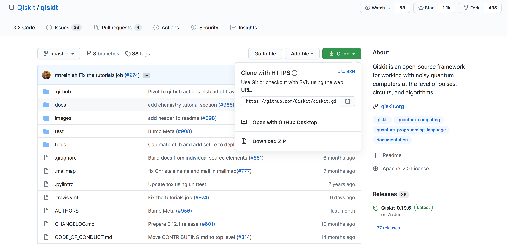
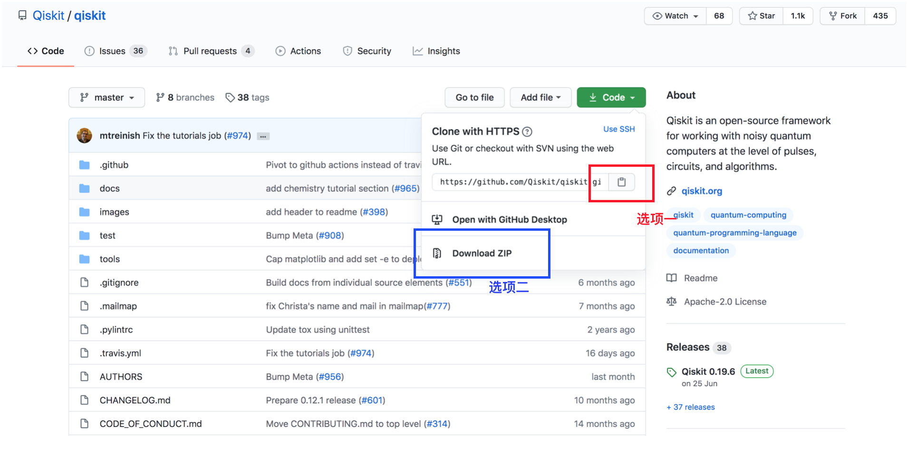

# Qiskit 学习笔记

## Qiskit特点

​	Qiskit是一种领域特定语言(DSL, Domain-Specific Language)。

### Terra

​	Terra，四大元素之中的土元素，作为Qiskit剩余部分的基础。Terra提供了在电路和脉冲层面组成量子程序的基础，目的是优化对于特定设备的约束，并管理远程访问设备上批处理实验的执行。Terra通过定义界面，获得了理想的终端用户体验，以及优化层次，脉冲调度和后端通信高效处理。

​	Qiskit.Terra由下面的六个模块组成：

1. [`qiskit.circuit` ](https://qiskit.org/documentation/apidoc/circuit.html#module-qiskit.circuit) 
   + **概述** 在计算通过执行一系列操作和量子比特时，量子电路是量子计算的一个模型。量子电路通常以$|0,...0\rangle$的状态开始，并且这些量子门将量子位演化为无法在传统计算机上有效表示的状态。为了提取出储存在量子电路状态中的信息，必须通过测量的方式将结果映射到经典寄存器上，只有在经典寄存器上才可以有效表示。
2. [`qiskit.pulse`](https://qiskit.org/documentation/apidoc/pulse.html)
   + **概述** 一个脉冲调度是一个被送到量子实验中作用于某个通道（实验输入线）的脉冲的集合。在软件栈中，相对于量子线路是更低的一个层次，并且在这一层次中，需要将线路上的量子门被表示为一系列脉冲的形式。在这一层次可以通过设计实验减少错误（dynamic decoupling, error mitigation and optimal pulse shapes).
3. [`qiskit.transpiler`](https://qiskit.org/documentation/apidoc/transpiler.html)
   + **概述** 在量子线路上研究的很大一部分都在如何让量子线路在量子设备上运行。在这些设备上，计算时的实验错误和退相干都会引入错误。这样，为了得到一个鲁棒的实现，有必要减少线路中门的数量和整体运行时间。转译器(The transpiler)引入了阶段管理器(pass manager)的概念，这可以让使用户对于他们的算法寻找优化并且发现一个更好的量子电路。将它称为转译器是因为最终结果仍然是电路的形式。
4. `qiskit.provider`
   + **概述** 当用户想让电路在后端上运行时，他们需要一种方便的方式在上面工作。在Terra中我们使用以下四个部分完成这项工作：
     + `Provider`是实现抽象基类[`BaseProvider`](https://qiskit.org/documentation/stubs/qiskit.providers.BaseProvider.html#qiskit.providers.BaseProvider)的实体，并且提供了使用一组不同后端的访问途径（例如，通过IBM Quantum Experience可用的后端）。举例来说，它通过与那些后端交互，找到哪些后端可用或者取回某一特定后端的实例。
     + `Backend`是实现抽象基类`Backend`的实体，代表着一个模拟器或者是一个真实的量子计算机用于运行量子线路并且返回结果。他们有一个运行方法，将*qjob*作为输入，并返回一个`BaseJob`对象。这一对象使得工作异步进行，当工作完成了之后可以从后端取回结果
     + `Job`实例是抽象基类`BaseJob`的实现，可以被认为是一个提交作业的”门票“。他们可以在某个时间点判断执行状态（例如，工作被排队，执行或者执行失败）并且允许控制工作。
     + `Result` 当工作完成时，Terra使得结果可以从远程后端得到通过`result = job.result()`。结果对象中保存了量子数据，最常见的与其交互的方法是通过使用`result.get_counts(circuit)`。这一方法允许用户从量子电路中获取原始计数，并将其用Terra提供的量子信息工具进行更多分析。
5. `qiskit.quantum_info`
   + **概述** 为了在量子计算机上执行高级算法和线路分析，有工具执行实现简单的量子信息工作是很重要的。这些方法既可以估算指标，也可以生成量子状态，操作和通道。
6. `qiskit.visualization`
   + **概述** 在Terra中，我们有许多方法可视化量子线路。这使得我们可以对量子线路做一个快速检查以确保它是用户想要的量子线路。存在文本，python和latex的版本。当线路开始执行，能够看到输出是很重要的。这里存在一个简单函数`plot_histogram()`能绘制包含交互式版本的量子线路结果。同时还有函数`plot_state()`和`plot_bloch_vector`实现对量子态的绘制。

## Qiskit安装

### Github学习

​	Git是目前世界上最先进的分布式版本控制系统，不需要服务器端软件，就可以运作版本控制，使得源代码的发布和交流极其方便。git的速度很快，这对于诸如Linux内核这样的大项目来说自然很重要。git最为出色的是它的合并追踪（merge tracing）能力。而**GitHub**是通过Git进行版本控制的软件源代码托管服务平台。

​	关于git的具体教程可以参考[廖雪峰的Git教程](https://www.liaoxuefeng.com/wiki/896043488029600)。接下来以Qiskit为例，简单介绍如何从Github上clone项目：

1. 首先，找到你想要clone的项目在Github中的位置。以Qiskit为例，其代码仓库在Github中的网址为[Qiskit](https://github.com/Qiskit/qiskit)；
2. 其次，在当前网址中的右上方找到绿色的**Code**按键，点击后会出现如下的视图



3. 这时你有两种选择将代码拷贝到本地：

   

   + 选择红框中的按钮保存链接，在终端中(Linux, Mac)或者WSL中(Windows)中利用指令

     ```
     git clone CLONE_URL
     ```

     将代码库clone到当前所在目录下

   + 选择蓝框中的按钮下载ZIP包，下载完成后利用解压获得代码库

4. 之后，如果Github上的代码更新，可以在工作目录下通过`git pull`指令将新的版本“拉”到本地

### 辅助工具安装

​	在安装Qiskit包之前，我们需要安装`anaconda`和`jupyter`两项工具。

#### Anaconda

**介绍**

​	Anaconda（[官方网站](https://link.zhihu.com/?target=https%3A//www.anaconda.com/download/%23macos)）就是可以便捷获取包且对包能够进行管理，同时对环境可以统一管理的发行版本。Anaconda包含了conda、Python在内的超过180个科学包及其依赖项。

**安装**

​	可以在官网下载对应系统的包进行安装，可以参考网站[2]。

#### Jupyter安装

**介绍**

​	Jupyter Notebook（前身是IPython Notebook）是一个基于Web的交互式计算环境，用于创建Jupyter Notebook文档。Notebook一词可以通俗地引用许多不同的实体，主要是Jupyter Web应用程序、Jupyter Python Web服务器或Jupyter文档格式（取决于上下文）。

​	之所以使用Jupyter Notebook，是因为其相对于在终端使用Python，生成的图片都可以保存下来。但是使用Python同样可以运行Qiskit。

**安装**

在新创建的conda环境中，利用pip包管理器安装即可：

```
pip3 install jupyter notebook
```

此时你可以通过`which jupyter`指令看到jupyter在你的新环境中，例如对于我来说，我的虚拟环境名为`qiskit`，其输出为：

```
/home/parallels/Documents/Anaconda/envs/qiskit/bin/jupyter
```

也可以使用conda安装：

```
conda install jupyter
```

**自动补全**

首先需要安装显示目录功能的插件：

```sh
pip install jupyter_contrib_nbextensions
```

安装后需要配置nbextension，注意配置的时候要确保已经关闭Jupyter Notebook

### Qiskit 安装[4]

#### 安装

​	创建一个只有安装Python的最小环境：

```
conda create -n name_of_my_env python=3.8
```

​	激活你的环境：

```
conda activate name_of_my_env
```

​	接下来，安装Qiskit包，其中包含了Terra, Aer, Ignis和Aqua

```sh
pip install qiskit
```

​	如果包成功安装，你可以用`pip list | grep qiskit`检查，结果如下：

```
qiskit                0.19.6
qiskit-aer            0.5.2
qiskit-aqua           0.7.3
qiskit-ibmq-provider  0.7.2
qiskit-ignis          0.3.3
qiskit-terra          0.14.2
```

​	如果你希望使用可视化功能，推荐安装visualization包作为额外需求：

```sh
pip install qiskit[visualization]
```

·	安装好了之后，你可以通过Python将其导入到环境中：

```Python
import qiskit
```

#### 访问IBM量子系统

​	完成了之前的步骤后，你就可以通过Qiskit.Aer提供的模拟器在自己的经典计算机上执行量子电路。如果你想要在真实机器上运行，你可以按照以下步骤：

1. 创建一个IBM账号；

2. 打开导航栏中的用户->**My Account**；
3. 点击**Copy token**将令牌复制到剪贴板；
4. 在本地执行以下指令以将API令牌存储在本地的配置文件`qiskitrc`当中，替代`MY_API_TOKEN`为你在剪贴板中存取的值：

```python
from qiskit import IBMQ
IBMQ.save_account(`MY_API_TOKEN`)
```

### Q&A

**问题一**

Q: 无法创建新环境。执行`conda create -n qiskit python=3.8`后终端输出

```sh
Collecting package metadata (repodata.json): done
Solving environment: done
```

然后直接退出，但是`conda env list`中没有qiskit。

A: 解决办法：利用`conda clean --all`清理安装包，之后再重新创建新环境。

**问题二**

Q: conda删除虚拟环境出错。在用conda建立虚拟环境后，未指定python版本

```sh
conda create -n env_name
conda remove -n env_name --all
```

出现：PackagesNotFoundError: The following packages are missing from the target environment:

A: 采用以下命令即可

```sh
conda env remove -n env_name
```

## Qiskit 使用

### 运行Qiskit-terra

在工作目录下运行：

```
jupyter notebook
```

以我的电脑为例，之后会输出：

```
(qiskit)  chenmingyu@parallels-vm  ~/Documents/work/Qiskit  jupyter notebook
[I 18:16:24.346 NotebookApp] Serving notebooks from local directory: /home/parallels/Documents/work/Qiskit
[I 18:16:24.347 NotebookApp] The Jupyter Notebook is running at:
[I 18:16:24.347 NotebookApp] http://localhost:8888/?token=c1ce5048a8c3fd0cdeacd760e9f7c4fe8a5b27507a9941cf
[I 18:16:24.347 NotebookApp]  or http://127.0.0.1:8888/?token=c1ce5048a8c3fd0cdeacd760e9f7c4fe8a5b27507a9941cf
[I 18:16:24.347 NotebookApp] Use Control-C to stop this server and shut down all kernels (twice to skip confirmation).
```

此时代表jupyter已经运行在[网页](http://127.0.0.1:8888/?token=c1ce5048a8c3fd0cdeacd760e9f7c4fe8a5b27507a9941cf)上。

之后关于jupyter的使用请参照[3]，而src文件夹下包含了以下若干个程序：

| 程序         | 完成功能                                                     |
| ------------ | ------------------------------------------------------------ |
| plot_H.ipynb | 程序来自[1]，主要完成了Qiskit的基本使用，如量子电路的构建和模拟器上运行量子电路 |
| Ep3.ipynb    | 程序来自[Qiksit视频系列](https://www.youtube.com/playlist?list=PLOFEBzvs-Vvp2xg9-POLJhQwtVktlYGbY)的Ep3，部分内容与上一个程序相同，主要对比了在模拟器上运行和在真实机器上运行之间的差别。在程序中实现了在IBMQ机器运行程序 |
| Ep4.ipynb    | 程序来自[Qiskit视频系列](https://www.youtube.com/playlist?list=PLOFEBzvs-Vvp2xg9-POLJhQwtVktlYGbY)的Ep4，程序分别用Bloch球，状态向量和测量的方式表示了量子态 |
| Ep5.ipynb    | 程序来自[Qiskit视频系列](https://www.youtube.com/playlist?list=PLOFEBzvs-Vvp2xg9-POLJhQwtVktlYGbY)的Ep5，程序利用量子线路实现了量子信息的传送 |

另外，qiskit-terra在github上提供了[example文件夹](https://github.com/Qiskit/qiskit-terra/tree/master/examples)，包含了python和qasm的量子程序示例。先列举python文件夹提供的各个文件的作用：

+ [using_qiskit_terra_level_0.py](https://github.com/Qiskit/qiskit-terra/blob/master/examples/python/using_qiskit_terra_level_0.py)
  + **概述** 给新手展示如何使用Qiskit-terra编程。该样例展示了使用qiskit-terra的基本方法，建立了电路并且让其在BasicAer提供的模拟器上运行。
  + **问题** 并没有在程序中找到注释中提到的"IBMQ(remote IBMQ provider)"和"transpiler function for level 1 user"

+ [circuit_draw.py](https://github.com/Qiskit/qiskit-terra/blob/master/examples/python/circuit_draw.py)
  + **概述** 展示了如何利用Qiskit作图
  + **特点** 在做图上调用了[QuantumCircuit](https://qiskit.org/documentation/stubs/qiskit.circuit.QuantumCircuit.html#qiskit.circuit.QuantumCircuit)类本身所具有的draw方法，而非使用更加丰富可视化工具的[`qiskit.visualization`](https://qiskit.org/documentation/apidoc/visualization.html#module-qiskit.visualization)模块

+ [commutation_relation.py](https://github.com/Qiskit/qiskit-terra/blob/master/examples/python/commutation_relation.py)

  + **概述** 展示了量子线路中存在的对易关系，并利用优化器根据对易关系对量子线路做简化
  + **特点** 程序中使用了两个[`qiskit.transpiler`](https://qiskit.org/documentation/apidoc/transpiler_passes.html)的两个Pass：[`commutation_analysis`](https://github.com/Qiskit/qiskit-terra/blob/master/qiskit/transpiler/passes/optimization/commutation_analysis.py)和[`commutative_cancellation`](https://github.com/Qiskit/qiskit-terra/blob/master/qiskit/transpiler/passes/optimization/commutative_cancellation.py)。根据程序中的注释，前者实现的是找到DAG结点之间的对易关系，后者则是根据对易关系消除冗余门。
  + **问题** 原代码中往阶段管理器添加了两个Pass以实现消除对易门的功能，但是如果只添加一个`commutative_cancellation`Pass也是能够得到消除对易门的`new_circuit`>

+ [ghz.py](https://github.com/Qiskit/qiskit-terra/blob/master/examples/python/ghz.py)

  + **概述** 建立得到GHZ态(Greenberger–Horne–Zeilinger态)的量子电路
  + **特点** 比较值得注意的应该就是GHZ态的构造方法，在Qiskit的使用上没有什么特别的

+ [initialize.py](https://github.com/Qiskit/qiskit-terra/blob/master/examples/python/initialize.py)

  + **概述** 利用初始门创建随机纯态
  + **特点**  
    + 调用了[QuantumCircuit.initialize](https://qiskit.org/documentation/stubs/qiskit.circuit.QuantumCircuit.initialize.html#qiskit.circuit.QuantumCircuit.initialize)接口初始化线路状态，根据输入的向量添加黑盒使线路得到想要的初态；
    + 利用模拟器运行的结果与想要的结果一致

+ [load_qasm.py](https://github.com/Qiskit/qiskit-terra/blob/master/examples/python/load_qasm.py)

  + **概述** 如何加载QASM文件的样例
  + **说明** 利用[QuantumCircuit.from_qasm_file](https://qiskit.org/documentation/stubs/qiskit.circuit.QuantumCircuit.from_qasm_file.html#qiskit.circuit.QuantumCircuit.from_qasm_file)接收一个QASM文件并产生一个QuantumCircuit对象，对于较大规模的电路构建挺有用的

+ [qft.py](https://github.com/Qiskit/qiskit-terra/blob/master/examples/python/qft.py)

  + **概述** QFT的示例程序

+ [rippleadd.py](https://arxiv.org/abs/quant-ph/0410184)

  + **概述** 基于[论文](https://arxiv.org/abs/quant-ph/0410184)设计的ripple adder电路

+ [stochastic_swap.py](https://github.com/Qiskit/qiskit-terra/blob/master/examples/python/stochastic_swap.py)

  + **概述** 使用`SchocasticSwap`优化阶段的实例
  + **说明** 在[schocastic_swap.py](https://github.com/Qiskit/qiskit-terra/blob/master/qiskit/transpiler/passes/routing/stochastic_swap.py)中对`SchocaticSwap`类进行了注释：将一个DAG线路通过添加swap操作映射到连通映射，使用的是随机算法。注意：
    1. 测量可能会在线路中出现而且之后有swap操作，这将会导致对同一量子比特的重复测量。短期内的实验没办法实现这这些电路，所以实验过程中需要多注意使用该映射的实验后端目标。
    2. 我们并不基于输入态为0来简化电路

+ [teleport.py](https://github.com/Qiskit/qiskit-terra/blob/master/examples/python/teleport.py)

  + **概述** 量子态传输实例

  以下是python文件夹下的ibmq文件夹内容，其中包含的程序均实现了远程访问IBMQ设备：

+ [ibmq/ghz.py](https://github.com/Qiskit/qiskit-terra/blob/master/examples/python/ibmq/ghz.py)

  + **概述** 相对于ghz.py，该程序利用的是远程IBMQ设备运行程序

  + **特点** 相对于利用模拟器运行的ghz程序，利用真实量子机器运行中的噪声使得结果并不满足1：1的关系，而是存在其他状态。下面是本地运行的结果:

    ```
    Physical device (ibmq_london) : 
    {'10001': 2, '01111': 27, '01101': 6, '11011': 10, '11000': 25, '01011': 1, '10010': 1, '10110': 5, '11111': 251, '00001': 8, '11101': 53, '00110': 14, '11010': 5, '00010': 113, '00100': 10, '11001': 4, '10111': 14, '00101': 2, '10000': 6, '11110': 52, '11100': 20, '10011': 1, '00011': 16, '10101': 1, '01100': 4, '01000': 3, '01010': 1, '00111': 7, '01110': 4, '00000': 358}
    ```

    对比ghz.py运行的结果：

    ```
    Qasm simulator : 
    {'00000': 526, '11111': 498}
    ```

  + **说明** 在访问IBMQ设备上，调用了[`qiskit.provider.ibmq`](https://qiskit.org/documentation/apidoc/ibmq_provider.html?highlight=qiskit provider ibmq#module-qiskit.providers.ibmq)模块的[`least_busy`](https://qiskit.org/documentation/stubs/qiskit.providers.ibmq.least_busy.html#qiskit.providers.ibmq.least_busy)接口。least_busy接口的描述如下：

    > Return the least busy backend from a list.
    >
    > Return the least busy available backend for those that have a `pending_jobs` in their `status`. Note that local backends may not have this attribute.
    >
    > Parameters：**backends** (`List`[`BaseBackend`]) – The backends to choose from.

    在本例中，使用方法如下：

    ```python
    provider = IBMQ.load_account()
    
    # Second version: real device
    least_busy_device = least_busy(
      		provider.backends(simulator=False,
                           filters = lambda x: x.configuration().n_qubits > 4))
    ```

    `least_busy`的参数是后端列表`backends`，在其中还能添加筛选条件。

+ [ibmq/qft.py](https://github.com/Qiskit/qiskit-terra/blob/master/examples/python/ibmq/qft.py)

  + **概述** qft.py在真实设备上运行的版本，在线路的构造上与qft.py一致，差别仅在于provider

+ [ibmq/hello_quantum.py](https://github.com/Qiskit/qiskit-terra/blob/master/examples/python/ibmq/hello_quantum.py)

  + **概述** 制备贝尔态，分别利用模拟器(local provider)和IBMQ设备(remote provider)运行量子线路
  + **特点** 相对简单而且程序的注释比较完善

+ [ibmq/using_qiskit_terra_level_0.py](https://github.com/Qiskit/qiskit-terra/blob/master/examples/python/ibmq/using_qiskit_terra_level_0.py)

  + **概述** 新手版基本的Qiskit-Terra的实例，相比于ibmq/hello_quantum.py要复杂一点

+ [ibmq/using_qiskit_terra_level_1.py](https://github.com/Qiskit/qiskit-terra/blob/master/examples/python/ibmq/using_qiskit_terra_level_1.py)

  + **概述** 普通版Qiskit-Terra使用。

  + **特点** 它创建了几个简单的电路，并利用[qiskit.compiler.transpile](https://qiskit.org/documentation/stubs/qiskit.compiler.transpile.html#qiskit.compiler.transpile)对生成的电路进行转译使之与后端匹配。然后创建qobj作为后端运行的容器，将其提交到不同的后端上。这对于想对比同样的电路在不同的后端上运行的效果或者仅想改变运行参数是有用的。而利用阶段管理器对阶段进行控制，这是level 2用户需要学会的东西。

  + **说明** qobj的创建不能直接利用创建的电路，需要根据实验用的后端`least_busy_device`先对线路进行处理使之兼容，再得到qobj

    ```Python
    # Transpile the circuits to make them compatiable with the experimental backend
    [qc1_new, qc2_new] = transpile(circuits=[qc1, qc2], backend=least_busy_device)
    
    # Assemble the two circuits into a runnable obj
    qobj = assemble([qc1_new, qc2_new], shots=1000)
    ```

+ [ibmq/using_qiskit_terra_level_2.py](https://github.com/Qiskit/qiskit-terra/blob/master/examples/python/ibmq/using_qiskit_terra_level_2.py)

  + **概述** 高级版Qiskit-Terra使用。程序构建了若干程序，并用阶段管理器对线路进行处理。

### 注意事项

1. 如果在jupyter使用过程中出现ImportError，请查看Jupyter当前使用的Python版本是否是包所安装的对应版本。

## 参考

[1] [Getting Started with Qiskit](https://qiskit.org/documentation/getting_started.html)

[2] [Anaconda介绍、安装及使用教程](https://zhuanlan.zhihu.com/p/32925500)

[3] [Jupyter Notebook介绍、安装及使用教程](https://zhuanlan.zhihu.com/p/33105153)

[4] [Installing Qiskit](https://qiskit.org/documentation/install.html)

