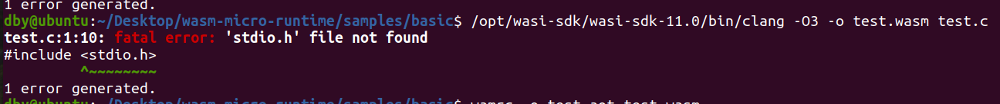
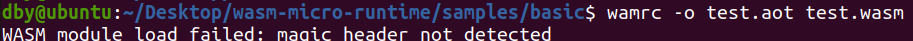

## WAMR配置

环境：Ubuntu20.04

#### 准备工作

下载 [wasi-sdk](https://github.com/WebAssembly/wasi-sdk/releases) 8.0或以上的版本，之后将其解压至 `/opt/wasi-sdk` 路径下（这里建议直接将解压后的文件夹重命名为`wasi-sdk`之后放在`/opt/`目录下，路径不对的话后边的配置会出现问题）

#### 配置iwasm

安装并编译LLVM

```bash
   cd product-mini/platforms/linux/
   ./build_llvm.sh     # 该脚本会把llvm源代码clone到<wamr_root_dir>/core/deps/llvm并且自动编译
```

安装依赖

```bash
sudo apt install build-essential cmake g++-multilib libgcc-8-dev lib32gcc-8-dev # Ubuntu18.04及以上的版本
sudo apt install build-essential cmake g++-multilib libgcc-5-dev lib32gcc-5-dev # Ubuntu16.04
```

编译源代码

```bash
cd product-mini/platforms/linux/
mkdir build && cd build
cmake ..
make
```

如果要enable WASM JIT，那么可以改为：

```bash
cd product-mini/platforms/linux/
mkdir build && cd build
cmake .. -DWAMR_BUILD_JIT=1
make
```

当然它也支持更多的选项，详细的信息请参考https://github.com/bytecodealliance/wasm-micro-runtime/blob/main/doc/build_wamr.md

#### 配置wamrc

```bash
cd wamr-compiler
./build_llvm.sh
mkdir build && cd build
cmake ..
make
```


## WebAssembly Micro Runtime SDK配置

```bash
cd wamr-sdk
./build_sdk.sh -n [profile name] -x [config file path]
```


## 构建第一个WASM应用

**生成wasm字节码**

可以写一个和下面代码类似的test.c程序：

```c
#include <stdio.h>
#include <stdlib.h>

int main(int argc, char **argv)
{
    char *buf;

    printf("Hello world!\n");

    buf = malloc(1024);
    if (!buf) {
        printf("malloc buf failed\n");
        return -1;
    }

    printf("buf ptr: %p\n", buf);

    sprintf(buf, "%s", "1234\n");
    printf("buf: %s", buf);

    free(buf);
    return 0;
}
```

用以下命令生成wasm字节码：

```bash
/opt/wasi-sdk/bin/clang -O3 -o test.wasm test.c
```

**使用cmake构建项目**

可以为test.c写一个如下的CMakeLists.txt

```bash
cmake_minimum_required (VERSION 3.5)
project(hello_world)

set (CMAKE_EXE_LINKER_FLAGS "${CMAKE_EXE_LINKER_FLAGS},--export=main")
add_executable(hello_world test.c)
```

之后就可以使用如下代码构建：

```bash
mkdir build && cd build
cmake .. -DCMAKE_TOOLCHAIN_FILE=$WAMR_ROOT/wamr-sdk/app/wamr_toolchain.cmake
make
```

**将wasm编译为AoT模块**

```bash
wamrc -o test.aot test.wasm
```

**运行WASM APP**

使用WAMR配置中编译源代码后生成的iwasm来运行（以本文中的Linux环境为例，iwasm可执行文件位置在`product-mini/platforms/linux/build`路径下

```bash
./iwasm test.wasm   or
./iwasm test.aot
```


## 配置过程中可能遇到的问题

* 使用clang编译C程序报错 “fatal error: 'stdio.h' file not found”

  错误：这个是因为路径设置错误，上图中路径为`/opt/wasi-sdk/wasi-sdk-11.0/bin/clang`，而实际上需要的路径为`/opt/wasi-sdk/bin/clang`
  解决：改为上述路径就解决问题了（不过没太明白原因）

* 使用wamrc生成.aot文件，或使用iwasm运行时报错"magic header not detected"
  
  错误：在编译.wasm文件时没有使用sdk中的clang
  解决：使用`/opt/wasi-sdk/bin/clang`进行编译生成.wasm文件